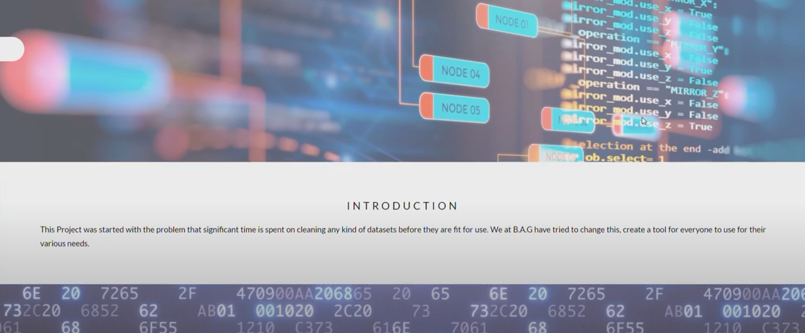

# BAG
Automated Data Cleaning Web Application

#### AIM:

The aim of this project is to host a web application which inputs a dataset and returns a modified datset according to series of checks 

Datsets are in the csv format

## Screenshots

  
&nbsp; &nbsp; &nbsp; &nbsp;
  

  
&nbsp; &nbsp; &nbsp; &nbsp;
  

## GIFs

Currently on hold...
